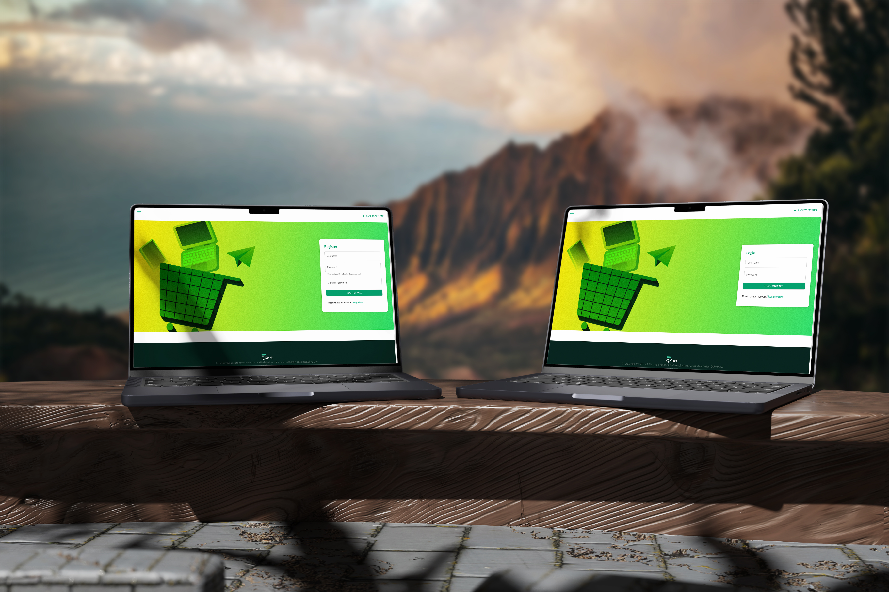
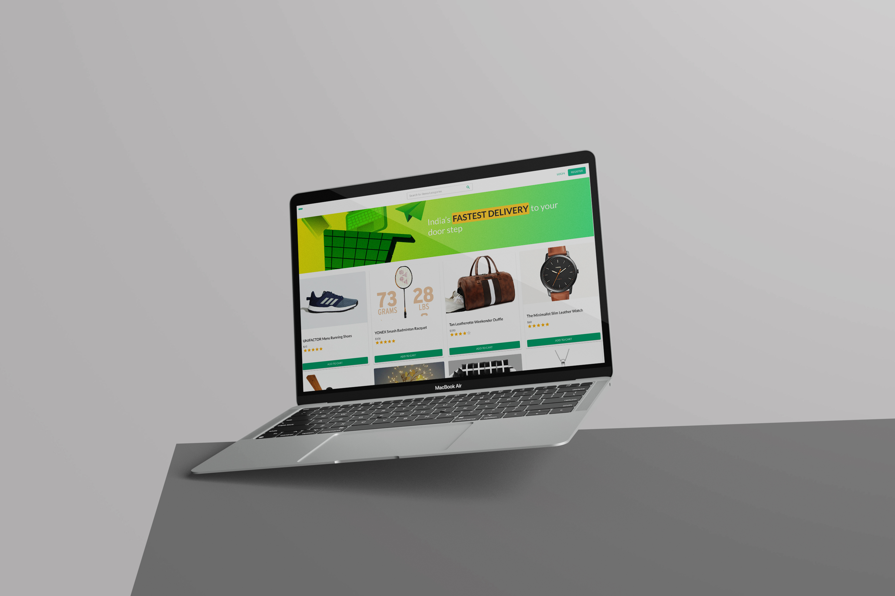
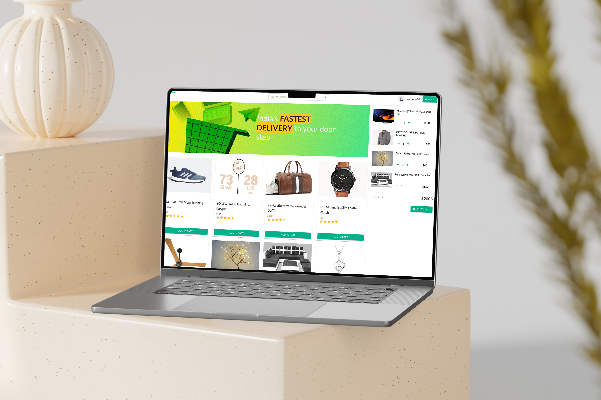
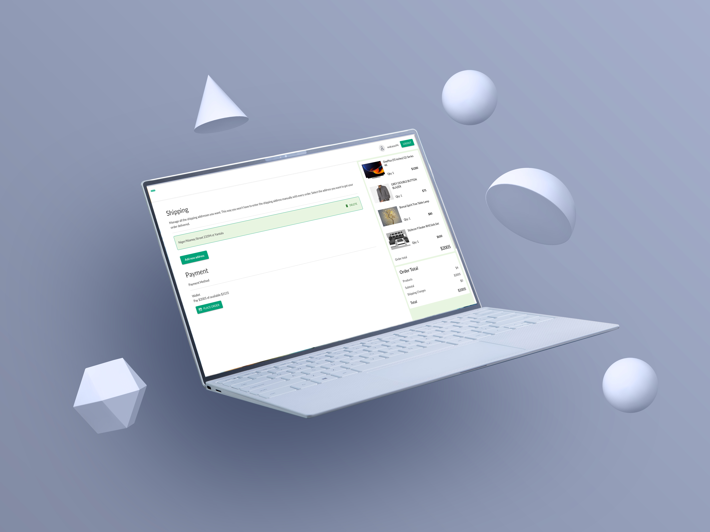
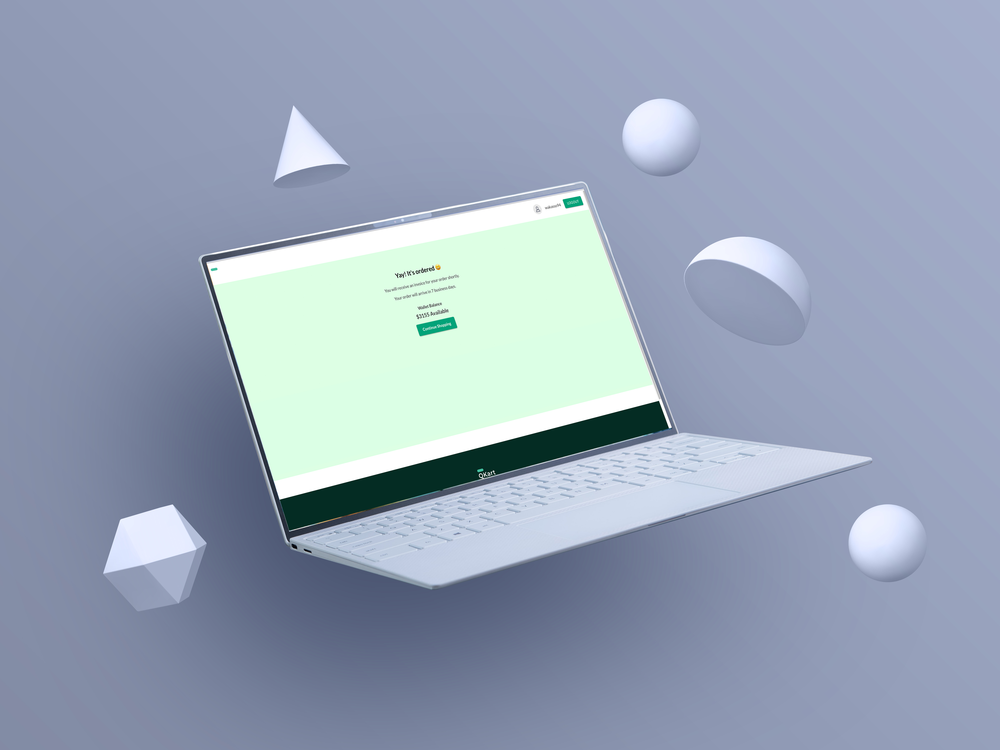

# QKART_FRONTEND

QKART_FRONTEND is a full-fledged e-commerce application developed using the MERN (MongoDB, Express.js, React.js, Node.js) stack. It provides a seamless shopping experience, allowing users to browse products, add items to their cart, and complete a secure checkout process. This project showcases essential features such as user authentication, cart management, and secure payment processing.

## Screenshots







## Features

- **User Registration & Authentication**: 
  - Users can register and log in using their credentials.
  - Bcrypt has been used for secure password hashing, ensuring that user passwords are stored securely.

- **Shopping Cart**: 
  - Users can add products to the cart, adjust quantities, and remove items.
  - The total cart value is dynamically updated based on the quantity and cost of items.

- **Secure Checkout**: 
  - Only authenticated users can proceed to the checkout page.
  - The checkout process is secure, with all sensitive routes protected from unauthorized access.

- **Protected Routes**: 
  - Implemented to ensure that certain areas of the applic`ation are accessible only to logged-in users.
  - Enhances user privacy and prevents unauthorized data access.

## Tech Stack

- **Frontend**: 
  - React.js with Material UI for responsive design and user interface components.
  - Deployed on [Vercel](https://www.vercel.com/) for high availability and fast content delivery.

- **Backend**: 
  - Node.js with Express.js for handling API requests and business logic.
  - Deployed on [Render](https://render.com/) for reliable and scalable server infrastructure.

- **Database**: 
  - MongoDB Atlas, a cloud-based NoSQL database, is used for managing and storing application data, ensuring scalability.

- **Authentication**: 
  - Bcrypt is used to hash passwords, providing strong security for user data.
  - JWT (JSON Web Tokens) is used for token-based authentication, ensuring secure access to protected routes.

## Project Setup

1. Clone the repository:
   ```
   git clone https://github.com/wakassodev/wakassodesign-ME_QKART_FRONTEND_V2.git qkart_frontend
   cd qkart_frontend
   ```

2. Install the dependencies:
   ```
   npm install
   ```

3. Set up environment variables:
   - Create a `.env` file in the project root.
   - Add the necessary API keys and endpoints for your backend and database connections.

4. Start the development server:
   ```
   npm start
   ```

   The frontend will be available on `http://localhost:3000`.

5. For the backend, ensure you have the backend service running (available at your configured endpoint).

## Deployment

The project is deployed as follows:
- **Frontend**: Deployed on [Vercel](https://www.vercel.com/) for a fast and efficient content delivery network (CDN).
- **Backend**: Deployed on [Render](https://render.com/) for robust server infrastructure.
- **Database**: Hosted on MongoDB Atlas for scalable cloud data management.

## Future Improvements

- Integration of payment gateways like Stripe or PayPal for real-world checkout processes.
- Adding product reviews and ratings.
- Implementing advanced search and filter options to improve product discoverability.
  
## License

This project is licensed under the MIT License - see the LICENSE file for details.
